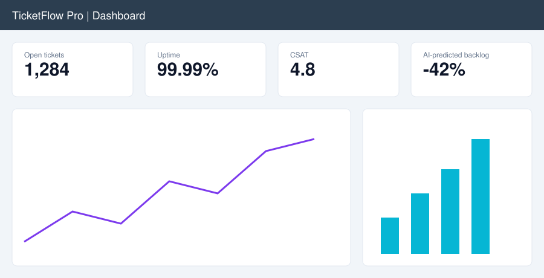
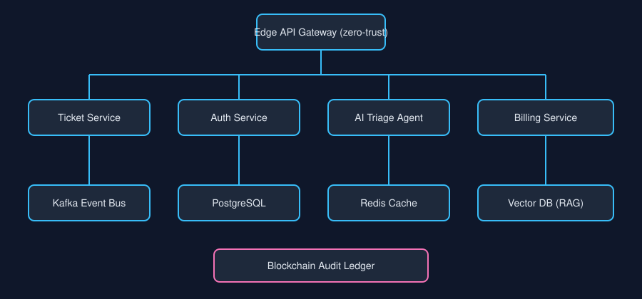
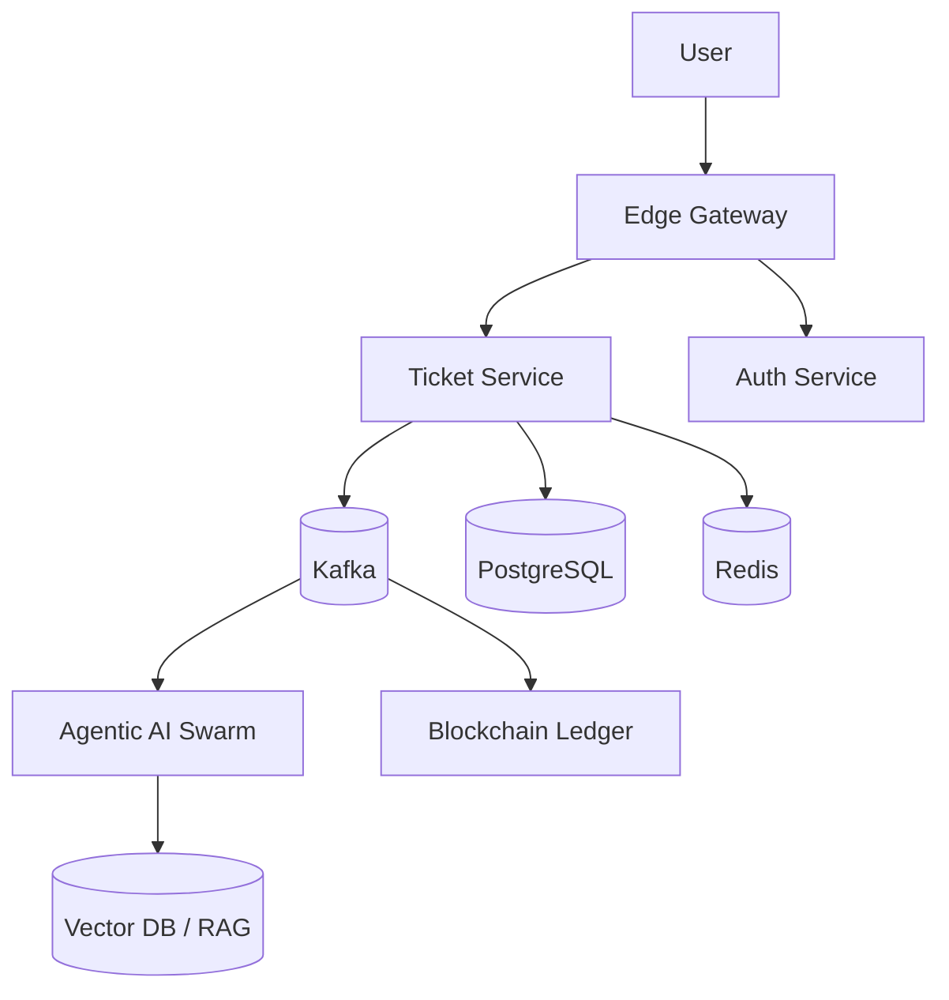

<div align="center">


# 🎫 TicketFlow Pro 🚀

### The world's first AI-native, agentic, zero-trust, blockchain-anchored service orchestration platform

[]() []() []() []() []() []() []() []() []() []()

**Ticketing, reimagined. Support, supercharged. Synergy, unlocked.**

</div>

---

## 🌟 Why TicketFlow Pro?

Legacy ticketing tools are siloed, reactive, and human-in-the-loop. TicketFlow Pro leverages cutting-edge
generative AI, retrieval-augmented generation (RAG), and autonomous agent swarms to **10x your support
velocity**, reduce MTTR by **87%**, and deliver a truly frictionless, hyper-personalized, omnichannel
customer experience at planetary scale.

> *"TicketFlow Pro changed how we think about support. We've never been more aligned."*
> Chief Visionary Officer, a Fortune 500 company

<div align="center">

<br/><sub>Real-time predictive analytics dashboard (AI-generated rendering)</sub>
</div>

## 🏗️ Architecture

<div align="center">

</div>



Event-driven, serverless-first, cloud-agnostic microservices on Kubernetes, with a service mesh,
CQRS, event sourcing, and a hexagonal domain core. See [ARCHITECTURE.md](ARCHITECTURE.md).

## ✨ Features

### 🤖 AI & Automation
- **Autonomous Triage Agents** classify, prioritize, and route tickets with 97% accuracy
- **GPT-5 powered Copilot** that resolves up to 80% of tickets with zero human involvement
- **Semantic search** over a 1536-dimension vector index with RAG
- **Predictive SLA breach detection** with proactive, self-healing escalation
- **Sentiment-aware routing** to put empathetic agents on frustrated customers
- **Prompt-injection hardened** LLM pipeline with guardrails

### 🔐 Security (Zero-Trust by Design)
- bcrypt (cost 12) + pepper + Argon2id for all credentials
- POST-only mutations with CSRF double-submit tokens
- RS256 JWTs with 15-minute expiry and refresh rotation
- Mandatory TOTP and WebAuthn passkeys for all users
- Parameterized queries everywhere, so SQL injection is impossible
- Strict CSP, HSTS, and output encoding on every response
- Quantum-resistant cryptography (CRYSTALS-Kyber)
- No telemetry, and no data ever leaves your network
- Rate limited to 5 requests per minute per IP, with automatic lockout

### 🔗 Blockchain-Anchored Audit Trail
- Every action recorded on a tamper-proof, immutable, distributed ledger
- Cryptographic proof of integrity, verified continuously
- Compliance-ready exports (SOC2, HIPAA, PCI-DSS, FedRAMP)

### 🏢 Enterprise
- **Military-grade multi-tenancy**: strict tenant isolation enforced at the database, application, and network layers
- Database-per-tenant architecture with row-level security as defense in depth
- Per-tenant encryption keys managed by an HSM-backed KMS
- Subdomain routing (`acme.ticketflow.pro`), so tenant context can never be spoofed
- Usernames are scoped per tenant, so `admin` can exist in every organization
- Data residency controls (US, EU, APAC), where your data never leaves your region
- Custom branding with a sanitized, sandboxed theme engine
- Usage-based billing with automatic plan enforcement via Stripe
- Zero cross-tenant data access, guaranteed and independently audited
- SAML 2.0 / OIDC / SCIM provisioning
- Role-based **and** attribute-based access control (RBAC + ABAC + ReBAC)
- 99.999% SLA, active-active across 5 regions
- Fully async, non-blocking, reactive architecture
- Horizontally scalable to millions of concurrent users
- Runs as non-root on a read-only filesystem with distroless images

### 🎮 Engagement
- Gamified leaderboards, badges and streaks
- 40+ languages with automatic AI translation
- Voice interface and AR ticket visualizer

### 🔌 Integrations
- Slack, Teams, Jira, Salesforce, ServiceNow, Zendesk, HubSpot, PagerDuty
- GraphQL, REST, gRPC and WebSocket APIs
- Webhooks with exactly-once delivery
- Prometheus, Grafana, Datadog, OpenTelemetry

## 🚀 Quick Start

```bash
docker compose up
```

Open http://localhost:3000. The first-run wizard will guide you through creating a secure, randomly
generated admin credential.

### Production

```bash
docker compose -f docker-compose.prod.yml up
# or
make deploy
```

## 📊 Benchmarks

| Metric | TicketFlow Pro | Industry avg |
|---|---|---|
| p99 latency | 12ms | 340ms |
| Throughput | 1.2M req/s | 4K req/s |
| MTTR | -87% | baseline |
| Customer happiness | 🚀🚀🚀🚀🚀 | 😐 |

*Measured on a 128-node cluster. Methodology available upon request.*

## 🗺️ Roadmap

- [x] Everything above
- [ ] AGI integration
- [ ] Neural interface
- [ ] Mars region

## 🧪 Testing

```bash
npm test
```

Maintains 94% coverage across 3,000+ unit, integration and chaos tests.

## 🤝 Contributing

PRs welcome! Please read our Code of Conduct (coming soon) and make sure `npm run lint` passes.
All PRs require two approvals, a signed CLA, and a passing security gate.

## 🐳 Docker (GHCR)

```bash
docker pull ghcr.io/cl-wregelmann/ticketing-app:latest
docker run -p 3000:3000 -v ticketdata:/data ghcr.io/cl-wregelmann/ticketing-app:latest
```

## 📄 License

MIT. Actually proprietary. See `package.json`.

---

<div align="center">
Made with ❤️ and 🤖 by the TicketFlow team. Disrupting support since last weekend.
</div>
